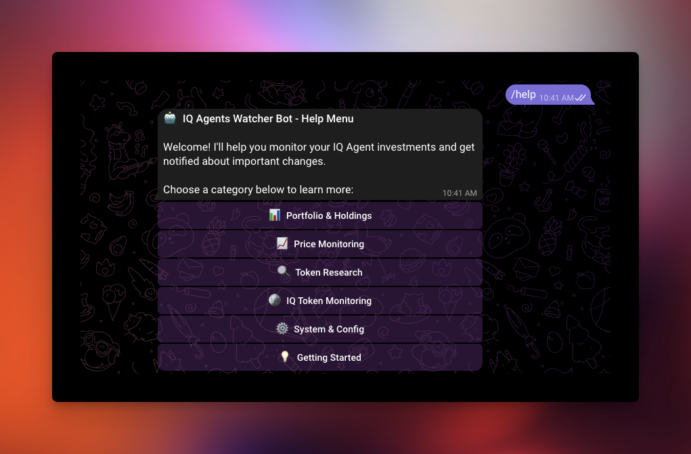
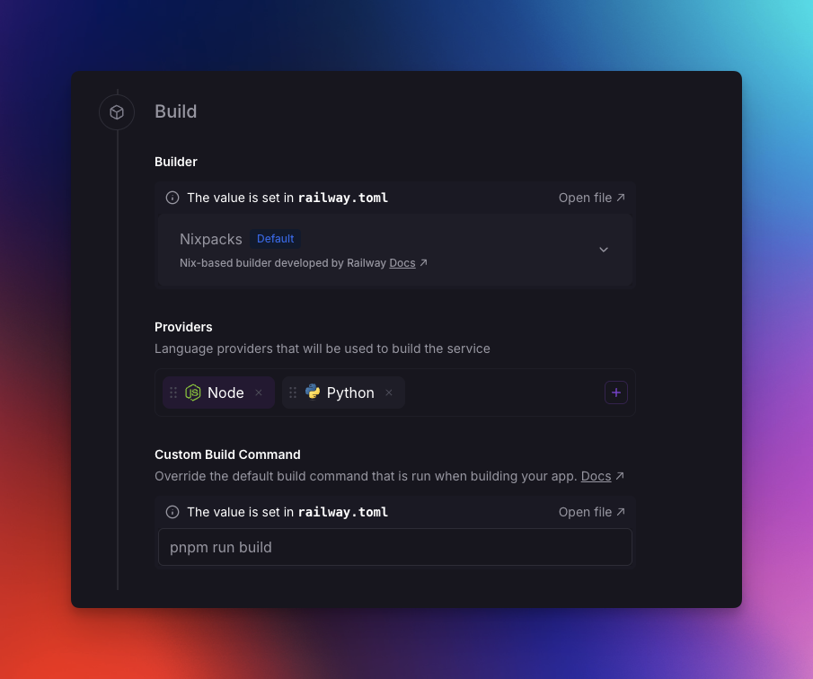

# 🤖 ATP Watcher Telegram Bot

A powerful Telegram bot for monitoring your IQ Agents portfolio. Get real-time notifications about portfolio value changes, price movements, agent statistics, and IQ token price fluctuations.



## ✨ Features

- 📊 **Advanced Portfolio Monitoring**: Track your total holdings value with configurable USD and percentage change thresholds
- 📈 **Modular Price Watching**: Monitor specific agent tokens with granular threshold levels (minor/major/critical)
- 🪙 **IQ Token Monitoring**: Dedicated monitoring for the base IQ token that affects all agent prices
- 🎯 **Smart Multi-Level Alerts**: Customizable severity-based notifications with fine-grained control
- 📱 **Rich Interactive Bot**: Comprehensive Telegram interface with inline buttons and advanced commands
- 🔄 **Real-time Updates**: Automatic monitoring with configurable intervals and intelligent alerting
- 💰 **Comprehensive Agent Analytics**: Get detailed information about any IQ Agent token
- 🗄️ **Persistent Storage**: SQLite-based data persistence for configurations, price history, and alerts
- ⚙️ **Maximum Customizability**: Extensive configuration options with sensible defaults

## 🚀 Quick Start

### Prerequisites

- Node.js 18+ and pnpm
- Telegram Bot Token (from [@BotFather](https://t.me/BotFather))
- Your wallet address

### Installation

1. **Clone the repository**

   ```bash
   git clone https://github.com/GPSxtreme/atp-watcher.git
   cd atp-watcher
   ```

2. **Install dependencies**

   ```bash
   pnpm install
   ```

   **Note**: The bot uses SQLite for persistent storage. If you encounter issues with `better-sqlite3` compilation, make sure you have:
   - Node.js 18+
   - Python 3.x (for native module compilation)
   - Build tools for your platform (Visual Studio Build Tools on Windows, Xcode on macOS)

3. **Set up environment variables**
   Create a `.env` file in the root directory:

   ```env
   # Telegram Bot Configuration
   TELEGRAM_BOT_TOKEN=your_telegram_bot_token_here
   
   # Your wallet address to monitor holdings
   WALLET_ADDRESS=0xYourWalletAddressHere
   
   # IQ API Configuration (default: https://app.iqai.com/api)
   IQ_API_BASE_URL=https://app.iqai.com/api
   
   # Monitoring Intervals (in seconds)
   HOLDINGS_CHECK_INTERVAL=300    # 5 minutes
   PRICE_CHECK_INTERVAL=60        # 1 minute
   
   # Default thresholds
   DEFAULT_HOLDINGS_THRESHOLD=1000      # USD
   DEFAULT_PRICE_CHANGE_THRESHOLD=5     # Percentage
   
   # Application Configuration
   NODE_ENV=development
   LOG_LEVEL=info
   ```

4. **Build and run**

   ```bash
   pnpm run build
   pnpm start
   ```

   Or for development:

   ```bash
   pnpm run dev
   ```

## 📋 Commands

### Portfolio & Holdings Management

- `📊 /portfolio` - View your complete portfolio with current values, holdings breakdown, and total worth
- `🎯 /set_threshold <amount>` - Set USD threshold for portfolio alerts (e.g., `/set_threshold 1000`)
- `📊 /set_change_threshold <percentage>` - Set percentage change threshold (e.g., `/set_change_threshold 10`)
- `⏰ /set_interval <seconds>` - Set monitoring interval (e.g., `/set_interval 300`)
- `▶️ /start_holdings` - Begin continuous portfolio monitoring with automatic alerts
- `⏹️ /stop_holdings` - Stop portfolio monitoring and alerts

### Advanced Price Monitoring & Alerts

- `👁️ /watch <token_address>` - Add token to watchlist for price change alerts
- `🎯 /watch_config <address> <threshold> [interval]` - Configure token with custom settings
- `🔧 /watch_advanced <address> <minor%> <major%> <critical%> [interval]` - Advanced threshold configuration
- `🔔 /alert_config <address> <minor:on/off> <major:on/off> <critical:on/off>` - Configure alert types
- `🚫 /unwatch <token_address>` - Remove token from watchlist
- `📈 /watched` - View all tokens you're monitoring with latest prices
- `▶️ /start_price` - Enable price monitoring service for all watched tokens
- `⏹️ /stop_price` - Disable price monitoring service

### IQ Token Monitoring (Base Token)

- `🪙 /iq_price` - Current IQ token price (base token for all agents)
- `▶️ /start_iq` - Start IQ token price monitoring
- `⏹️ /stop_iq` - Stop IQ token price monitoring
- `⚙️ /iq_config <minor%> <major%> <critical%> [interval]` - Configure IQ price thresholds
- `🔔 /iq_alerts <minor:on/off> <major:on/off> <critical:on/off>` - Configure IQ alert types
- `📊 /iq_status` - View IQ monitoring status and configuration

### Token Information & Research

- `📈 /top [mcap|holders|inferences] [limit]` - Show top performing agents (default: top 10 by market cap)
- `ℹ️ /info <token_address>` - Get detailed agent profile including bio, stats, and creation date
- `📊 /stats <token_address>` - View comprehensive statistics: price, market cap, holders, inferences
- `💰 /price <token_address>` - Get real-time price for any agent token

### System & Configuration

- `⚙️ /config` - View current configuration and monitoring settings
- `📊 /status` - System health check: monitoring status, database stats, tracked tokens
- `📊 /history <token_address> [limit]` - View price history for any token (default: last 10 prices)
- `🚨 /alerts` - View your recent alert history and notifications
- `⚙️ /settings` - View current configuration and available customization options
- `❓ /help` - Show complete command guide with examples

## 🎯 Advanced Use Cases

### Multi-Level Portfolio Monitoring

Set up comprehensive portfolio tracking with multiple alert levels:

```bash
/set_threshold 1000           # USD milestone threshold
/set_change_threshold 5       # 5% change alerts
/set_interval 300             # Check every 5 minutes
/start_holdings
```

### Granular Token Price Monitoring

Monitor tokens with different sensitivity levels:

```bash
# Basic monitoring
/watch_config 0x4dBcC239b265295500D2Fe2d0900629BDcBBD0fB 5 60

# Advanced multi-threshold monitoring
/watch_advanced 0x4dBcC239b265295500D2Fe2d0900629BDcBBD0fB 2 10 20 30

# Customize alert types
/alert_config 0x4dBcC239b265295500D2Fe2d0900629BDcBBD0fB on off on
```

### IQ Token Market Intelligence

Monitor the base token for market-wide insights:

```bash
/iq_config 2 10 20 60        # Minor: 2%, Major: 10%, Critical: 20%, 60s interval
/iq_alerts on on on          # Enable all alert types
/start_iq
```

### Complete System Setup

Get everything running with optimal configuration:

```bash
# Portfolio monitoring
/set_threshold 5000
/set_change_threshold 8
/start_holdings

# Price monitoring
/start_price

# IQ token monitoring
/iq_config 3 12 25
/start_iq

# Check status
/status
/config
```

## 🛠️ Advanced Configuration

### Environment Variables with Enhanced Descriptions

All environment variables now include detailed descriptions with units and context:

| Variable | Description | Default | Units |
|----------|-------------|---------|-------|
| `TELEGRAM_BOT_TOKEN` | Telegram bot token obtained from @BotFather for authenticating with Telegram API | Required | - |
| `WALLET_ADDRESS` | Ethereum wallet address (0x format) to monitor for IQ agent investments on Fraxtal network | Required | - |
| `IQ_API_BASE_URL` | Base URL for IQ AI API endpoints used to fetch agent data and prices | `https://app.iqai.com/api` | URL |
| `HOLDINGS_CHECK_INTERVAL` | Interval in seconds between portfolio holdings checks | `300` | seconds |
| `PRICE_CHECK_INTERVAL` | Interval in seconds between price checks for watched tokens | `60` | seconds |
| `DEFAULT_HOLDINGS_THRESHOLD` | Default threshold in USD for portfolio value change notifications | `1000` | USD |
| `DEFAULT_PRICE_CHANGE_THRESHOLD` | Default percentage threshold for price change notifications | `5` | % |
| `NODE_ENV` | Runtime environment mode affecting logging and error handling behavior | `development` | - |
| `LOG_LEVEL` | Minimum log level to output (debug < info < warn < error) | `info` | - |

### Runtime Configuration Options

#### Portfolio Monitoring

- **USD Thresholds**: Set milestone values for portfolio alerts
- **Percentage Thresholds**: Configure sensitivity for portfolio value changes
- **Monitoring Intervals**: Customize how frequently holdings are checked
- **Alert Types**: Enable/disable different notification types

#### Price Monitoring (Per Token)

- **Minor Thresholds**: 1-5% price changes (default: 2%)
- **Major Thresholds**: 5-15% price changes (default: 10%)
- **Critical Thresholds**: 15%+ price changes (default: 20%)
- **Individual Intervals**: Custom check frequencies per token
- **Alert Granularity**: Enable/disable minor, major, or critical alerts per token

#### IQ Token Monitoring

- **Base Token Tracking**: Monitor the fundamental token affecting all agent prices
- **Market Impact Alerts**: Notifications about potential market-wide price movements
- **Configurable Sensitivity**: Independent thresholds for IQ price monitoring

## 🏗️ Architecture

```bash
src/
├── env.ts                    # Enhanced environment configuration & validation with descriptions
├── index.ts                  # Main bot entry point with comprehensive command handling
└── services/
    ├── agents.ts             # IQ Agents API service with retry logic and caching
    ├── database.ts           # SQLite database service with enhanced schema
    ├── holdings-watcher.ts   # Advanced portfolio monitoring with configurable thresholds
    ├── price-watcher.ts      # Multi-level price monitoring with modular alerts
    └── iq-price-watcher.ts   # Dedicated IQ token price monitoring service
```

### Enhanced Key Components

- **AgentsApiService**: Handles all API calls to IQ Agents platform with intelligent retry logic and response caching
- **DatabaseService**: Enhanced SQLite-based persistent storage with advanced schema for modular configurations
- **HoldingsWatcher**: Advanced portfolio monitoring with USD and percentage thresholds, configurable intervals
- **PriceWatcher**: Multi-level token price monitoring with granular threshold control and per-token configuration
- **IQPriceWatcher**: Dedicated service for monitoring the base IQ token with market impact awareness
- **Telegram Bot**: Comprehensive command interface with advanced configuration and help systems

### Enhanced Database Schema

- **price_history**: Historical price data for all tracked tokens including IQ token
- **alerts**: Comprehensive alert history with severity levels and categorization
- **user_preferences**: Enhanced bot configuration storage with detailed preference management
- **watched_tokens**: Advanced token watch list with modular threshold configurations and alert settings

## 🗄️ Persistent Storage

The bot uses **SQLite** for comprehensive persistent storage, optimized for Railway deployment:

### Enhanced Storage Features

- ✅ **Modular Configurations**: Store complex threshold configurations per token
- ✅ **Alert History**: Complete audit trail of all notifications with severity levels
- ✅ **Price Analytics**: Comprehensive price history for trend analysis
- ✅ **User Preferences**: Granular storage of all customization options
- ✅ **Configuration Persistence**: All settings survive restarts and deployments

### Data Organization

- **Price History**: Track price movements over time for all tokens including IQ
- **Alert Management**: Complete history with categorization and severity levels
- **Configuration Storage**: Modular threshold settings, intervals, and alert preferences
- **Token Management**: Advanced watchlist with per-token configuration persistence

## 🔧 Development

### Scripts

```bash
# Development with hot reload
pnpm run dev

# Build TypeScript
pnpm run build

# Start production server
pnpm start

# Lint code
pnpm run lint

# Fix linting issues
pnpm run lint:fix

# Format code
pnpm run format

# Clean build files
pnpm run clean
```

### Adding New Features

1. **New Commands**: Add command handlers in `src/index.ts` with comprehensive help integration
2. **New Monitoring Services**: Create new watcher services in `src/services/` following the modular pattern
3. **API Integration**: Extend `src/services/agents.ts` for new endpoints with proper caching
4. **Database Extensions**: Update `src/services/database.ts` schema for new data requirements

## 📊 Enhanced Monitoring & Alerts

### Multi-Level Portfolio Alerts

- **USD Milestone Alerts**: When your portfolio hits specific dollar values
- **Percentage Change Alerts**: Configurable sensitivity for portfolio value fluctuations
- **Continuous Monitoring**: Real-time tracking with customizable check intervals

### Advanced Price Alert System

- **Minor Alerts** (🔵): 1-5% price changes for subtle market movements
- **Major Alerts** (🟠): 5-15% price changes for significant movements
- **Critical Alerts** (🔴): 15%+ price changes for major market events
- **Per-Token Configuration**: Independent settings for each monitored token
- **Alert Type Control**: Enable/disable specific severity levels per token

- **Base Token Monitoring**: Track the fundamental token that affects all agent prices
- **Market Impact Notifications**: Alerts about potential market-wide price movements
- **Severity-Based Messaging**: Different alert styles based on price change magnitude
- **Cross-Market Insights**: Understanding how IQ price changes affect the entire ecosystem

### Enhanced Error Handling

- Automatic retry logic with exponential backoff for API calls
- Graceful error handling with user-friendly notifications
- Comprehensive logging with configurable levels for debugging
- Circuit breaker patterns for API reliability

## 🔐 Enhanced Security

- Comprehensive environment variables validation using Zod with detailed error messages
- Input validation and sanitization for all user commands
- Rate limiting and request throttling through axios-retry
- Secure database operations with prepared statements
- No sensitive data persistence in memory or logs

## 📈 Performance Optimizations

- Intelligent API caching and retry mechanisms with circuit breakers
- Configurable monitoring intervals to balance responsiveness and resource usage
- Optimized database queries with proper indexing
- Memory-efficient operations for continuous monitoring
- Asynchronous processing for all monitoring services

## 🚀 Deployment

### Railway Deployment

The bot is optimized for Railway deployment with enhanced configuration:

1. **Fork this repository**
2. **Connect to Railway**: Link your GitHub repo to Railway
3. **Set environment variables** in Railway dashboard:

   ```bash
   TELEGRAM_BOT_TOKEN=your_bot_token
   WALLET_ADDRESS=your_wallet_address
   NODE_ENV=production
   LOG_LEVEL=info
   ```

4. **Deploy**: Railway will automatically build and deploy
5. **IMPORTANT**: Ensure you add Python as language provider to build better-sqlite3 binaries


### Railway Configuration

Create a `railway.json` file for optimal deployment:

```json
{
  "$schema": "http://json-schema.org/draft-07/schema#",
  "build": {
    "builder": "NIXPACKS"
  },
  "deploy": {
    "startCommand": "pnpm start",
    "restartPolicyType": "ALWAYS"
  }
}
```

The SQLite database will be stored in Railway's persistent filesystem with automatic optimization.

## 🐛 Troubleshooting

### Common Issues

1. **Bot not responding**: Check if `TELEGRAM_BOT_TOKEN` is correct and bot is running
2. **No portfolio data**: Verify `WALLET_ADDRESS` is correct and has holdings on Fraxtal
3. **API errors**: Check if IQ API is accessible and rate limits aren't exceeded
4. **Database errors**: Ensure proper file permissions and storage availability
5. **Compilation issues**: Install platform-specific build tools (see installation notes)
6. **Configuration issues**: Use `/config` command to verify all settings
7. **Alert spam**: Use `/alert_config` and `/iq_alerts` to fine-tune notification levels

### Debug Mode

Set `LOG_LEVEL=debug` in your `.env` file for comprehensive logging including:

- API request/response details
- Database operation logs
- Monitoring service status updates
- Configuration change tracking

### Advanced Troubleshooting

- **Monitoring Status**: Use `/status` to check all service health
- **Configuration Review**: Use `/config` for complete settings overview
- **Alert History**: Use `/alerts` to review recent notification patterns
- **Database Health**: Built-in database optimization and maintenance routines

## 🎮 Pro Usage Tips

### Optimal Configuration Strategy

1. **Start Conservative**: Begin with higher thresholds and longer intervals
2. **Gradual Tuning**: Reduce thresholds based on your noise tolerance
3. **Layered Monitoring**: Use different sensitivity levels for different tokens
4. **IQ Integration**: Always monitor IQ token for market-wide insights
5. **Regular Review**: Use `/config` and `/status` to review and optimize settings

### Advanced Monitoring Patterns

```bash
# High-value portfolio with sensitive monitoring
/set_threshold 10000
/set_change_threshold 3
/set_interval 180

# Major tokens with graduated alerts
/watch_advanced 0xTOKEN1 1 5 15 30
/watch_advanced 0xTOKEN2 2 8 20 60

# IQ market intelligence
/iq_config 1 5 12 45
/iq_alerts on on on
```

## 📄 License

MIT License - see [LICENSE](LICENSE) file for details.

## 🤝 Contributing

1. Fork the repository
2. Create your feature branch (`git checkout -b feature/amazing-feature`)
3. Commit your changes (`git commit -m 'Add some amazing feature'`)
4. Push to the branch (`git push origin feature/amazing-feature`)
5. Open a Pull Request

### Development Guidelines

- Follow the modular architecture pattern
- Add comprehensive command help integration
- Include database schema updates for new features
- Maintain configuration persistence for user settings
- Add appropriate error handling and logging

## 🔗 Links

- [IQ Agents Platform](https://app.iqai.com)
- [Telegram Bot API](https://core.telegram.org/bots/api)
- [Railway Deployment](https://railway.app)

---
